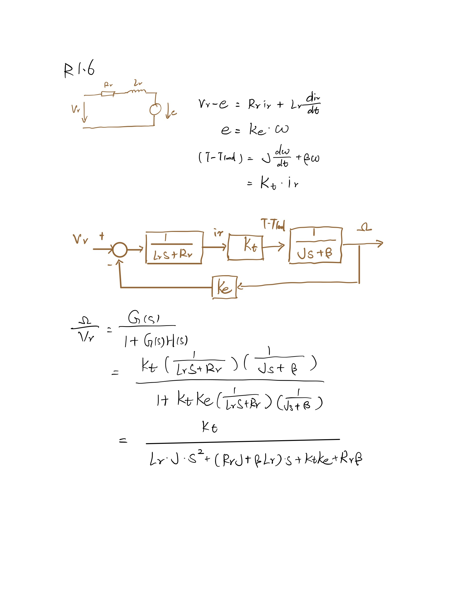
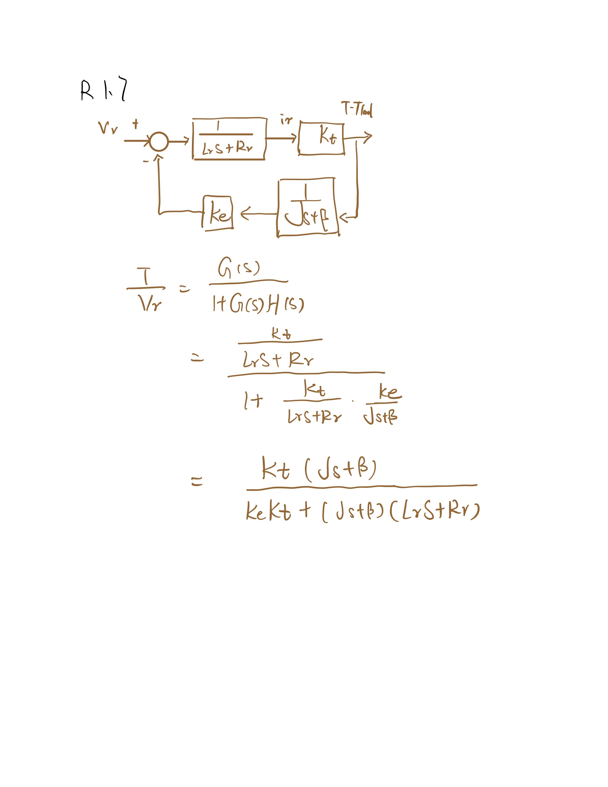

# R1.1
* Because there exists friction in the motor(from brushes for example) and this limits the motor speed.

# R1.2
* The observation is the zero load current is not zero, the explation for non-zero torque tau 0 is that the motor still need to overcome some friction force, this generates some small torque corresponds to tau0.

# R1.3
* In the start the rotation velocity w is small, so e=Ke*w is also small, since the supply voltage is 24V constant the voltage on resistor and inductor will be big, so the spike current can be observed.

# R1.4
* The largest efficiency is about 79 percent and it is find when angular velocity is 5504 rpm, current is 0.1518 A. The maximum power in this situation is 24W. The experiment protocal is increasing the ts from 0 to stall torque and observing its efficiency, the trend increases at first and decreases after the torque is about 0.05 Nm.

# R1.5
* According to the observation, the 100 Hz PWM has large influence on the current and rotation velocity of motor than 40kHz PWM. So the behaviour of the DC motor with respect to current and velocity should be a low pass filter.

# R1.6 
 

# R1.7 
 

# R1.8
The bode plot of transfer function for voltage-to-velocity and voltage-to-torque at line 75-82.
It is shown in figure 2 and figure 3.

# R1.9
* In practice the switching frequency is limited by the semiconductors, since high frequency and high power can not be achieved for some semiconductor switches.
