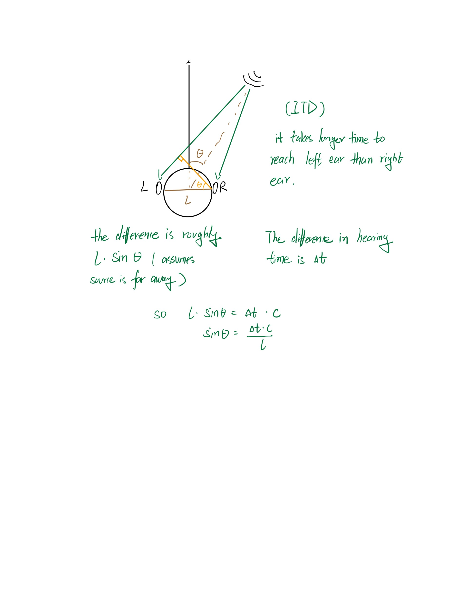
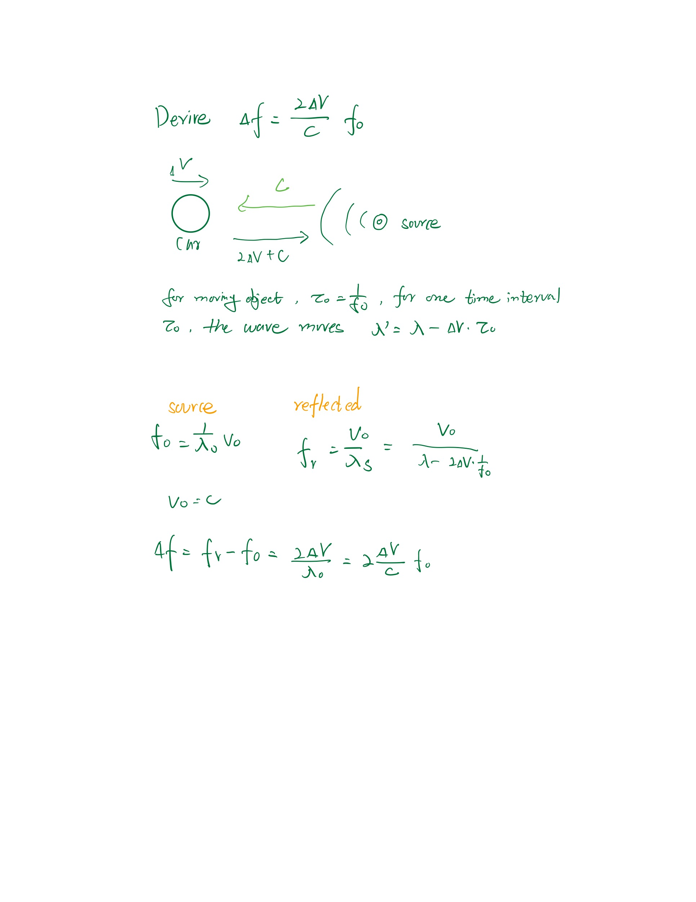

## R1.1
* Derive Interaural Time Difference 
*  
## R1.2
* Derive Doppler effect
* 
 
## R1.3
* To better measure the angle, we need to choose signal with larger wavelength so the delta t is easier to find.

## R1.4
* To better measure the speed of a moving object, we need to choose signal with high frequency so for the same velocity the measured delta f is latger.

## R2.1
* It depends on the data buffer available, we can do window fft but it is not able to extract low frequency components from it since the data window buffer length is limited.

## R2.2 
* We can use FFT to see what frequency componants does the signal contains and find the dominant frequency. 

## R3.1
* If there is no memory buffer available, pure online data streaming, there is no way to implement the cross-correlation since it requires also some past signals data.

## R3.2
* To use cross-correlation, we need to have a buffer to save part of the past data. In this way it is possible to identify a delay within certain range.

