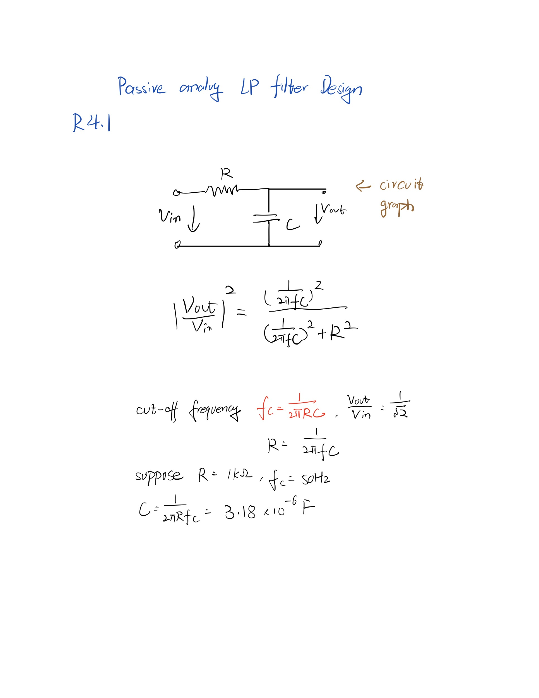
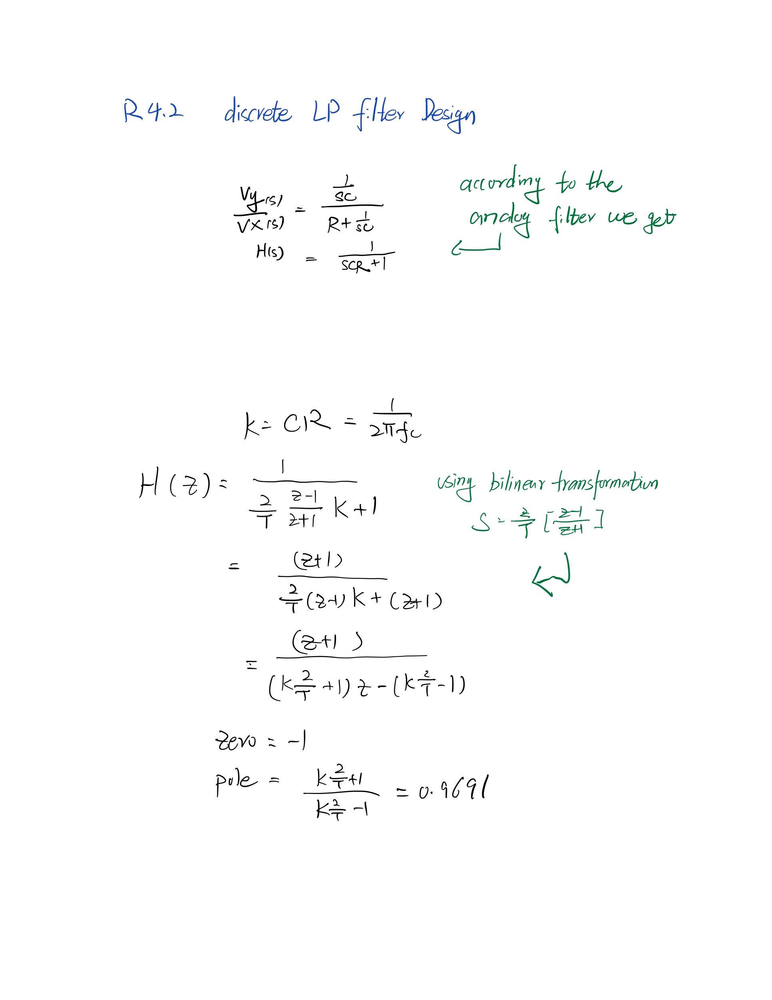
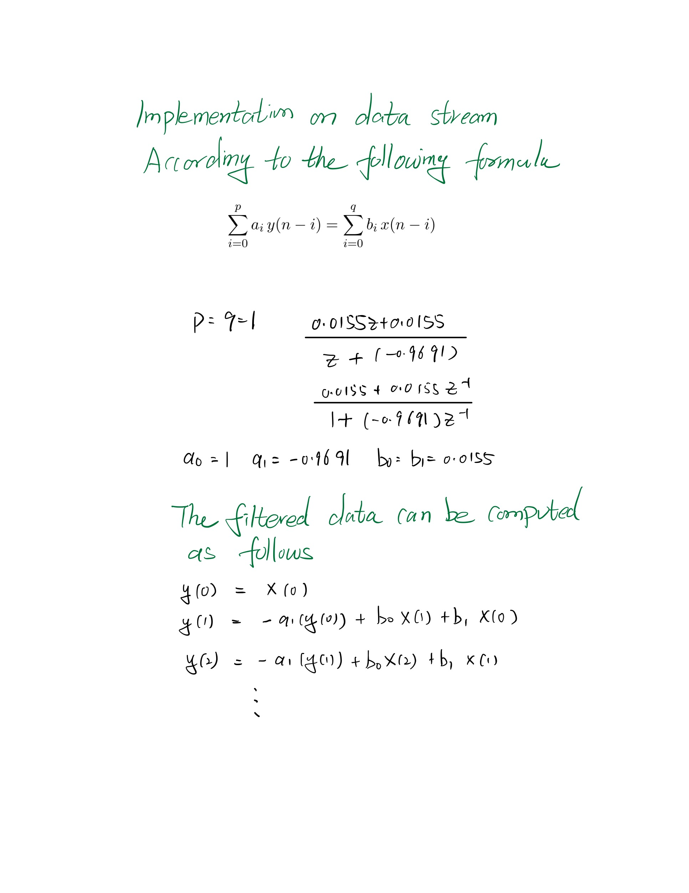
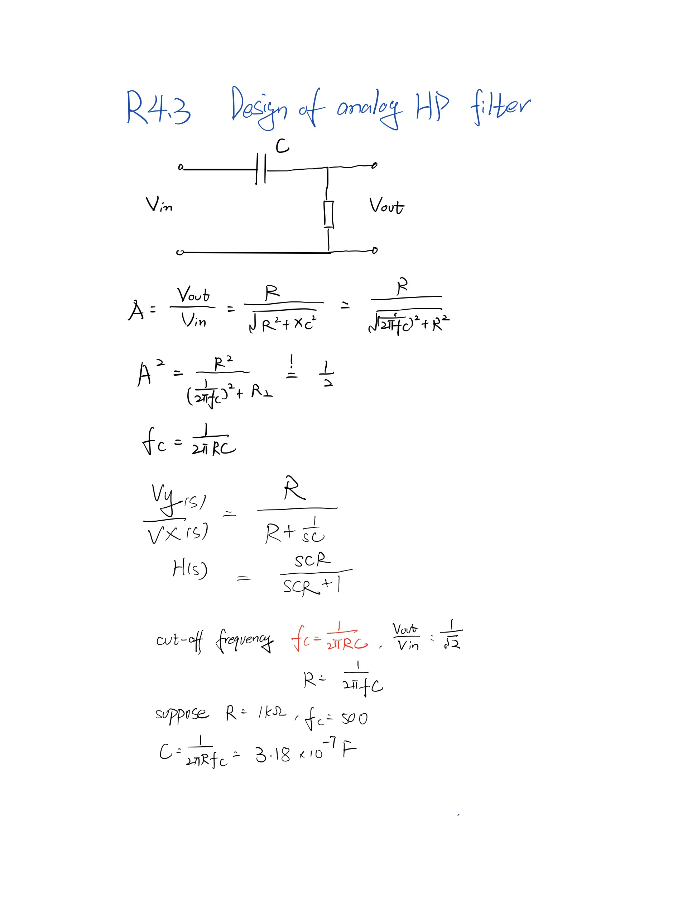
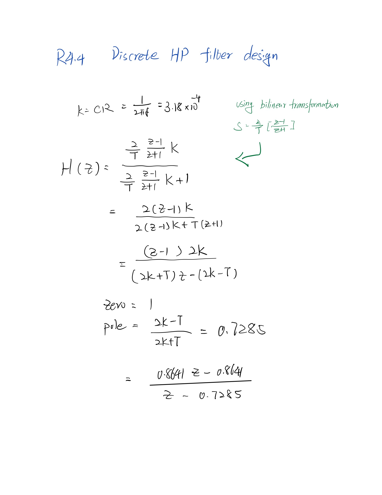
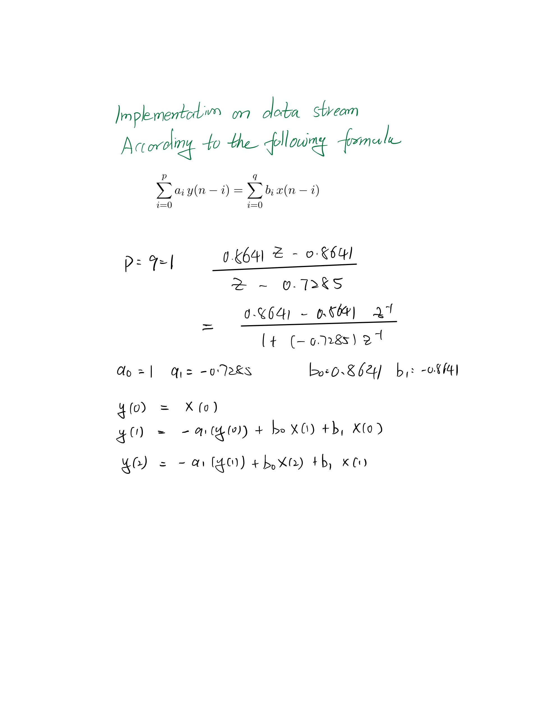
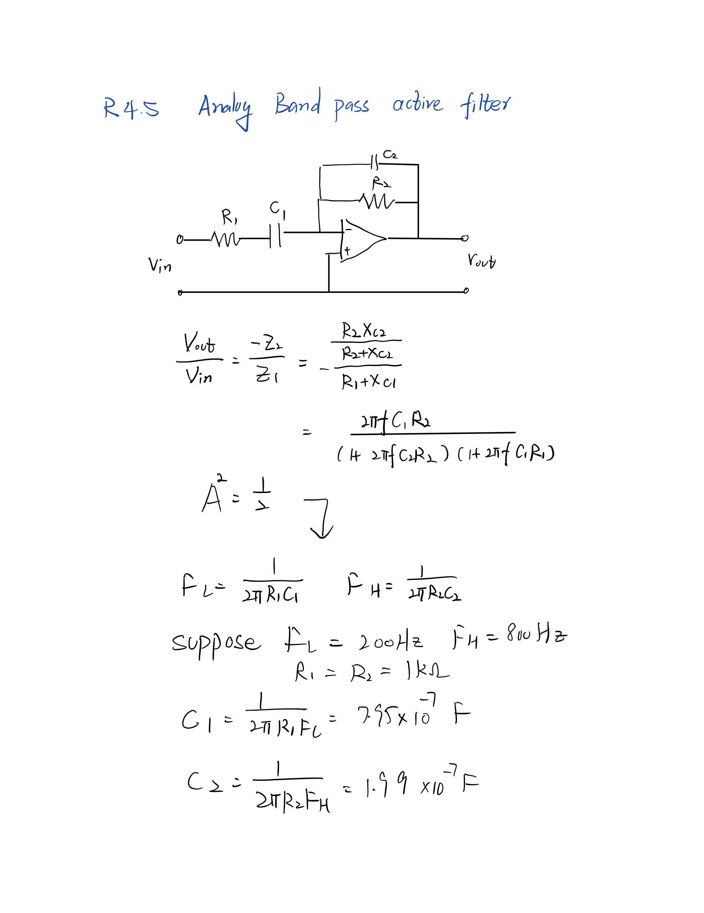
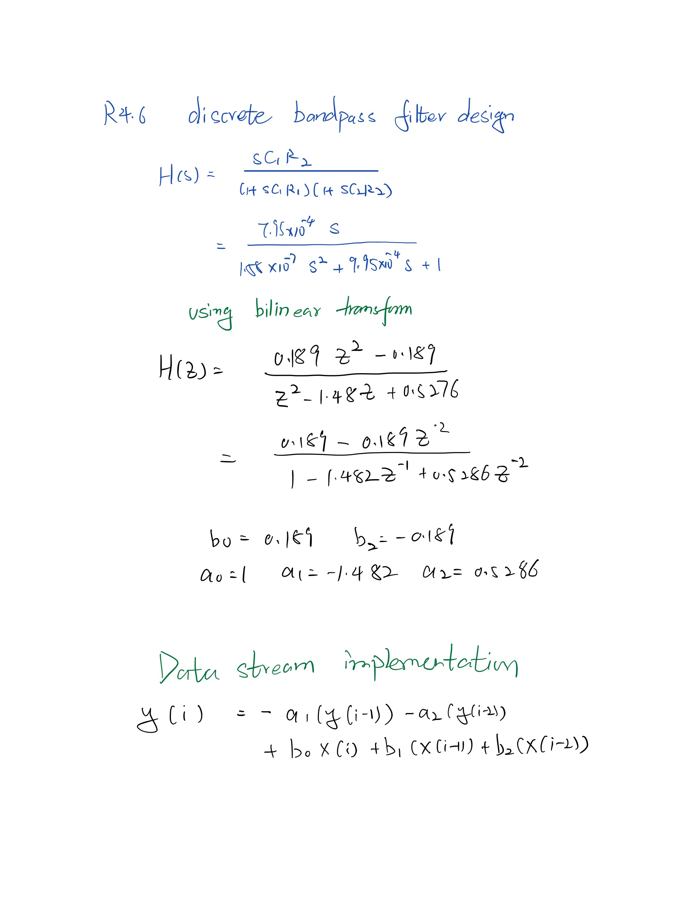

## R4.1
 * 

## R4.2
 * 

 * 

## R4.3
 * 

## R4.4
 * 

 * 
  
## R4.5
 * 

## R4.6
 * 

## R4.7 What is the difference between passive and active filters? 
1. Passive filter conly contains passive componants, such as resistors, capacitors and inductors; Active filter also uses active componants such as op-amp
2. The active filter need additional power resource for active components
3. The active filter performs better with load

## R4.8: What is the difference between FIR and IIR filters? 

* The FIR(Finite Impulse Response) filter is implemented as the following formula:

> $$y(n) = \sum_{k=0}^{N}a(k)x(n-k) $$
  
* The IIR(Infinite Impulse Response) filter can be implemented by the following formula, it is computed recursivly
    
> $$y(n) = \sum_{k=0}^{N}a(k)x(n-k) + \sum_{j=0}^{p}b(j)y(n-j) $$

* **The IIR(Infinite Impulse Response) filter** calculate the output recursivly and typically sharper than FIR filter with same order. So with same performance IIR is more computational cheap. But it is less stable. On the other hand, 
* **FIR(Finite Impulse Response) filter** has the same phase delay, which can not be achieved by IIR.

## R4.9: What is the “order” of a discrete filter?

* The order of discrete filter refers to the number of N in the following formula:

* A filter with higher order has sharper edges
  
## R4.10: How could you implement a continuous-time filter in a robotic system?

* A continous-time filter can be implemented with circuit components (R,C,L,op-amp). 

## R4.11: How could you implement a discrete-time filter in a robotic system?

* A discrete-time filter can be implemented with microcontroller, we can input the data stream and using IIR or FIR filter parameters to process them and output the result.
  
## R4.12: What are the advantages and disadvantages of analog and digital filters in robotic systems? 

* Analog filters
  1. Advantages: faster, no ADC requirement
  2. Disadvantages: additional hardware;can be affected by load, less accurate  

* Discrete filters
  1. Advantages: more accurate, programmable 
  2. Disadvantages: signals need to be digitalized with ADC; need additional analog filter to get rid of high frequency noise that above nyquist frequency to avoid aliasing effect.

## R4.13: Is it possible to make a 1000 Hz Low-Pass filter in a digital system with a sampling rate of 1000 Hz?

* It is not possible, the 1000Hz sampling rate can only recover signal within the range (0-500Hz) because of the nyquist sampling theory.

