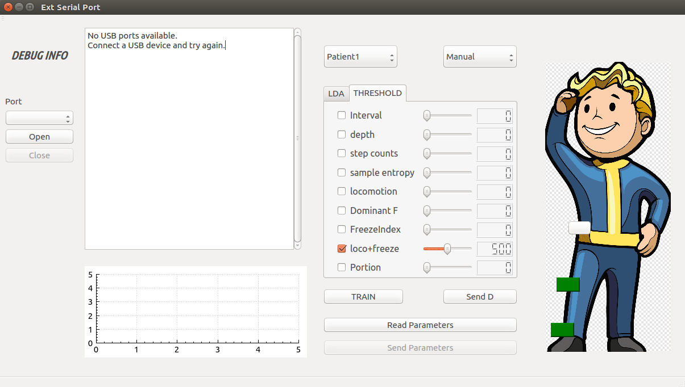
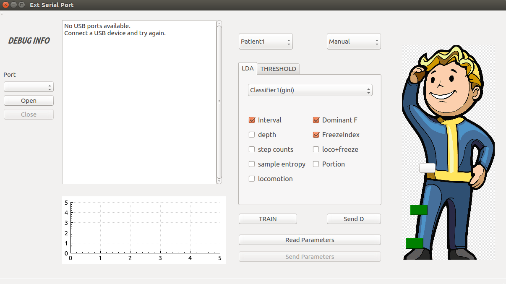
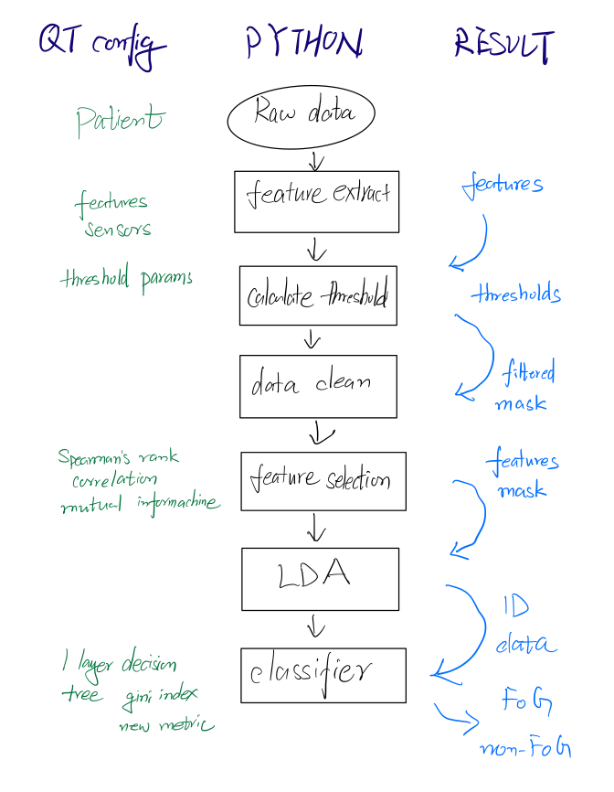
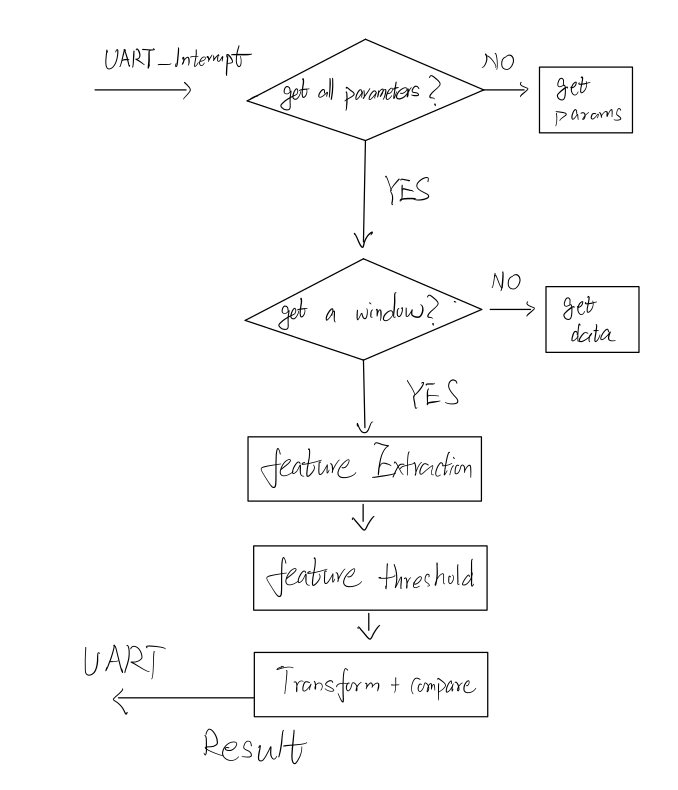

# FoG_detect

## Folders
> FoG_detect : main folder, put it into path /home/(user name)/
>   - **GUI** : Code for graphical user interface, written with qt.
>   - **PYTHON_IM** : Code that is used for data training purpose, it's get called by GUI and save calculated parameters into folder **Parameters**
>   - **validation_matlab (matlab R2020)** : In this folder you will find matlab code for the validation of algorithm, it is a 10-fold cross-validation. Just run tesing.m file. 
>  - **nRF52_code** : code to be flashed into nRF52 development board.
>  - **dataset** : DAPHNET dataset 
>  - **diary** : Report of research internship.

## GUI

The GUI interface has mainly two functions.
1. Make configuration to the training
2. Communication with hardware using UART
 
### **Configuration**
The first step is training the threshold parameters and LDA weights. Use the patient QComboBox to select the patient id, this helps the GUI program to load corresponding data.

Then open the Threshold Tab. Here features for threshold can be selected. The thresholds features are computed according to normal gait and stop gaits. For example, if the Smoothness feature is selected as one threhold feature, then the trainng python script will calculate the smoothness of data during the stop period, normally this would be a quite small value in compare with any motion. So data which smaller than certain value will be filtered out. The slidebar followed can be used to further configure the threshold value, for example, the default value is 500, which means the data is filtered out if its smoothness is smaller than 5 times the smoothness of stop period.

After configuring the thresholds, switch back to LDA tab, here the features for LDA will be selected. Also you can select different classifiers to do the classification. You can also use auto mode to autoconfigure the lda features based on spearman's rank correlation.

Classifiers available are :
> 1. Decision tree using new metrics 
> 2. Decision tree using scaled gini index

After the configuration, we can click the train button to call python program (python2.7) to train relevant parameters using dataset. After the training process is finished, it returns and informs the user and save results into a file at the same time. 
   
### **Communication**
Then user can further use GUI to send results of training and raw data measurement in window form to hardware with UART, the hardware returns the detection result back to user interface before it receives new window.

The procedure of using it is 
1. Configuration
2. Train
3. Read parameters
4. Send parameters
5. Send Data

# Python code

> Read parameters from UI

> Write calculated parameters into file

# C code

* The board is able to receive command using nRF connect app in smartphone and start to receive parameters and data.
* Receive parameters and data from UART, performs feature extraction and FoG detection. Returns result back to PC.
