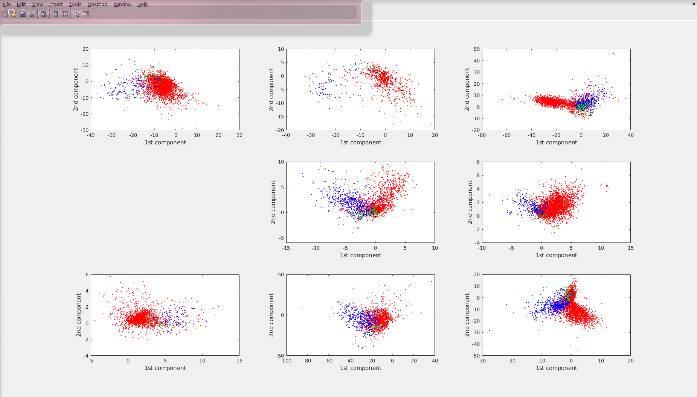
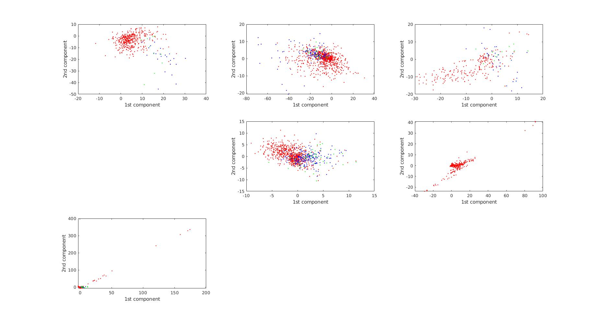
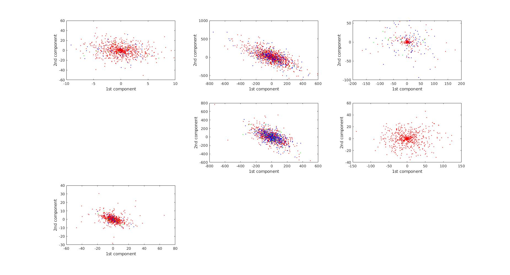

# Day1
* Find new feature which describes the **smoothness** of accelerometer data. Which is Variogram. It can be observed that the part of data in FoG fluctuates a lot while the part of data in noFoG is more smooth and have a certain pattern.

* Use normal *LDA* to try to separate data. 
  - The input is feature data of freezing index, dominant componant and variogram of.
  - The data are labeled as FoG, noFoG and preFoG according to their center time point.
  - The result for training data is different for different patients, as the following picture indicates:

 

  - The result for test data is as the following pictures indicates:

 

  - The result shows it is impossible to separate the data with selected features and lda.

 # Day2

* Use normal *LDA* to try to separate data. 
  - The input is all unprocessed data 
  - The data are labeled as FoG, noFoG and preFoG according to their center time point.
  - The result for training data is good, as the following picture indicates:

 

  - The result for test data is as the following pictures indicates:

 

  - The result shows it is impossible to separate the data with all original lda.

# Day3

* Use kernel LDA to separate data.
  - For the case of patient 1, training data:
   
  - It can be observed that 3 classes are well separeted into 3 point.
  - But such good separation can not be found for training data, all test points are put into the same point.
   

# Day4
- I have an interview with Florenc and we shared what we did in the last month. He told me that his original method does not work well for some new data collected from new patient and he is trying new method:
* using a library to extract some features from DAPHNET dataset before using a lda classifier and quadratic lda classifier and he is working on some parameter tuning now.

- The result he has now is:
1. The feature selection/PCA + LDA classifier classify almost all data as noFoG
2. The feature selection/PCA + quadratic LDA classifier classify almost all data as FoG

- He gives me some suggestion to either try his method or continuing doing some gait cycle analysis.
