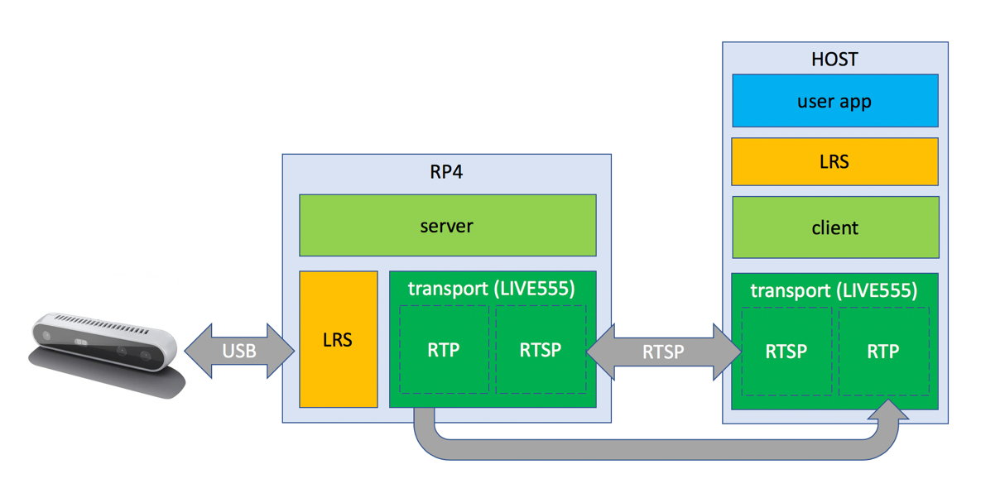

# Setup Raspberry Pi Environment
## 1. Install Ubuntu mate on Raspberry Pi4
1. Download the OS img from https://ubuntu-mate.org/download/arm64/focal/
2. Use card reader to flash the image into sd-card 

## 2. IP related configurations 
### 2.1 Get IP of RaspberryPi
1. Start RaspberryPi with inserted SD card
2. Finish the initial configuration
3. Install the ssh service on RP4,using
    > sudo apt-get install openssh-server
4. In terminal use command to get the ip address of RP4
   >hostname -I

### 2.2 Static IP configuration
* Since by default the dhcp service is automatically working and the IP address of Raspberry Pi is randomly allocated. And it changes whenever the raspberry pi changes WiFi connection (router), so it is inconvenient to check each time.
* Change the network configuring file into:

    > network:
    >>version: 2\
    >>renderer: networkd\
    >>wifis:
        >>>wlp3s0: #wifi connection, check the name of interface using ifconfig cmd in the terminal\
        >>>dhcp4: no\
        >>>dhcp6: no\
        >>>addresses: [192.168.1.10/24] \
        >>>gateway4: 192.168.43.1 \
        >>>nameservers:
        >>>> addresses: [8.8.8.8, 8.8.4.4]\
        >>> access-points: 
            >>>>>"AP-name": 
            >>>>>>password: "..."
* run the follwing cmd to reset network configuration
    > sudo netplan apply
## 3. Install necessay libs and sdk
* In this step, we download realsense git repository and build it from source to use its **rs-server**

### 3.1 Download librealsense github repository
> sudo apt-get install git cmake
 
> git clone https://github.com/IntelRealSense/librealsense.git

### 3.2 Prepare Linux Backend and the Dev. Environment
1. Navigate to librealsense root directory to run the following scripts.
Unplug any connected Intel RealSense camera.
2. Install the core packages required to build librealsense binaries and the affected kernel modules:
> sudo apt-get install libssl-dev libusb-1.0-0-dev pkg-config libgtk-3-dev libglfw3-dev libgl1-mesa-dev libglu1-mesa-dev

3. Intel Realsense permissions script from librealsense root directory:
> ./scripts/setup_udev_rules.sh

### 3.3 Build librealsense2 SDK
1. Navigate to librealsense root directory and run     
 > mkdir build && cd build
2. Run cmake
 > cmake .. -DBUILD_NETWORK_DEVICE=ON -DFORCE_RSUSB_BACKEND=ON
 > sudo make install -j4

## 4 Reference
* https://dev.intelrealsense.com/docs/using-depth-camera-with-raspberry-pi-3
* https://askubuntu.com/questions/1061131/wifi-problem-after-setting-static-ip-in-ubuntu-18-04-01-lts

# Network programming in Host side 
* The project uses industry standard RTP protocol for video streaming.
In addition, RTSP protocol is used for camera control. Networking is handled by Live555 ‎– open-source cross-platform library for low-power multimedia streaming. Depth compression is done using LZ4, color and infrared streams are compressed using libjpeg-turbo open-source library .

## 1 rs-server
 On the RP4 side, we use rs-server tool. This application will connect to first available Intel RealSense camera and listen for incoming connection requests.

 * Two options to use it :
 * 1. In terminal runs 
        > rs-server
* 2. Service which automatically runs 

## 2 realsense2-net

On the Host side, we use realsense2-net module. The module exports single function rs2_create_net_device and encapsulates all dependencies required for working with network cameras.

### 2.1 Modifying the SDK examples:
1. Inside CMakeLists.txt add realsense2-net to target_link_libraries 
2. Add #include <librealsense2-net/rs_net.hpp> to the code
3. Create network device from IP and add it to a context:
    > rs2::net_device dev("10.0.0.99");\
    > rs2::context ctx; dev.add_to(ctx);
4. Pass context to pipeline constructor:
    > rs2::pipeline pipe(ctx);
5. Before call pipe.start(), add configurations to it, for example :
    > rs2::config cfg;\
    > cfg.enable_stream(RS2_STREAM_DEPTH, 848, 480);\
    > pipe.start(cfg)

### 2.2 Configuration of stream
### 3 Reference
* https://dev.intelrealsense.com/docs/open-source-ethernet-networking-for-intel-realsense-depth-cameras
* https://intelrealsense.github.io/librealsense/doxygen/classrs2_1_1config.html